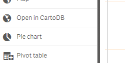
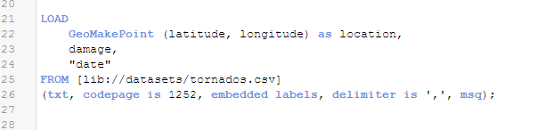
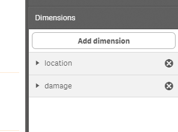
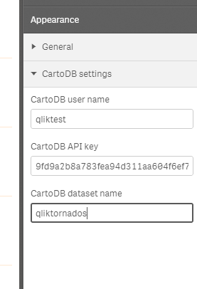
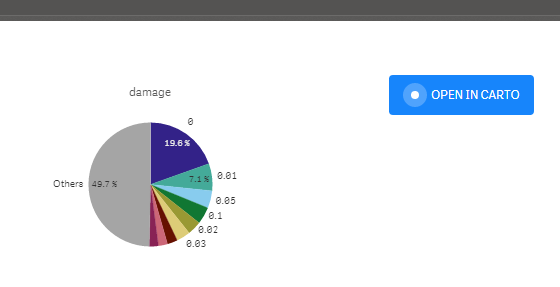
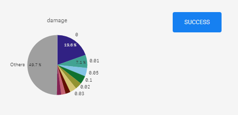
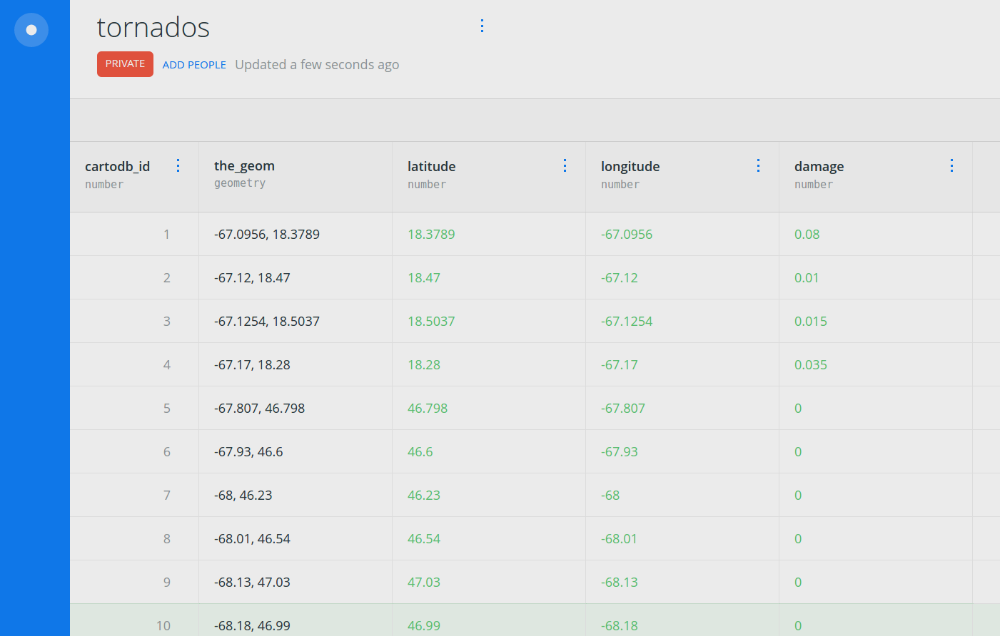
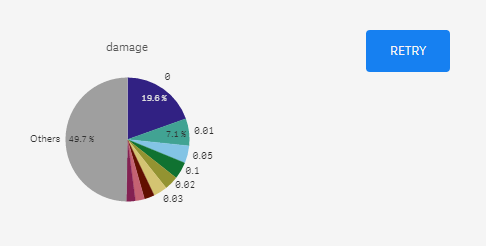

# Open in CARTO

(This README still doesn't explain how to create a map or dashboard in CARTO out of the exported dataset and visualize it back in Qlik, which is a feature recently added to the extenion. Also, screenshots are a bit out of date too. We'll fix this quite soon.)

_Open dataset in CARTO from Qlik Sense_

This extension creates a "Open in CARTO" button that can be used to send the (filtered) contents of the hypercube to CARTO.

## Installation

Copy the project folder under `<your HD unit>:\Users\<your user name>\Documents\Qlik\Sense\Extensions`, you should now see the _Open in CARTO_ extension on the charts tab.

## Configuration

This extension only works with dimensions. You need to have at least one geometry dimension, created with GeoMakePoint. Please make sure you add only one geometry dimension.

You can have as many other dimensions as you like.

Also, please make sure you fill in your CARTO credentials and desired table name.

## How it works

If a "Open in CARTO" widget is added to your sheet, you will see a "Open in CARTO" button that you can click anytime. When you click on the button, all the data that is currently selected (not filtered out) in the hypercube will be set to CARTO.

A new table will be created with the name you provided. If a table with the same already existed, it will be destroyed. The button will reflect the current status of the request. When "success" is displayed, that means the table has successfully been created in CARTO.

Please note that the new table make take a few seconds, sometimes minutes, to show up on the CARTO editor.

If an error occurs, the button will display a "retry" message.

