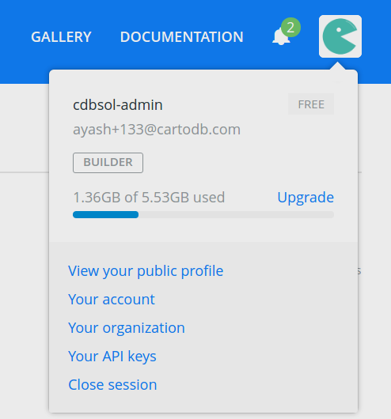
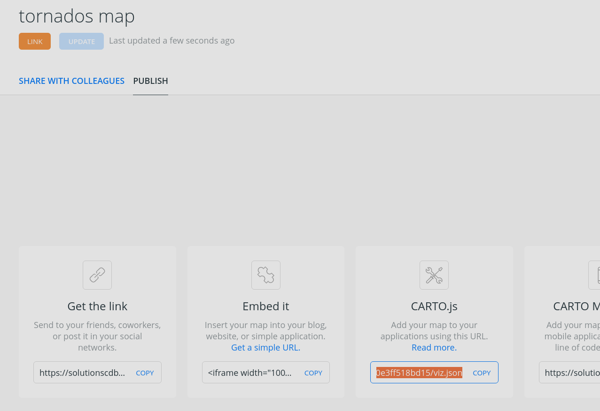
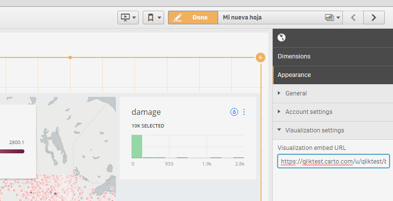
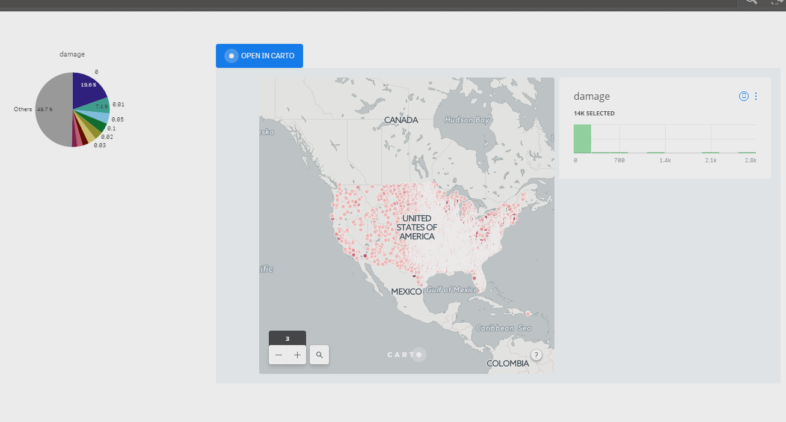

# Open in CARTO

_Open datasets in CARTO from Qlik Sense, and visualize geospatial apps created with CARTO's Builder in Qlik Sense_

This extension creates a "Open in CARTO" button that can be used to send the (filtered) contents of the hypercube to CARTO.

At the same time, it allows for existing CARTO visualizations to be embedded in Qlik Sense, no matter if they were originally created from datasets imported using _Open in CARTO_ or not.

## Installation

Copy the project folder under `<your HD unit>:\Users\<your user name>\Documents\Qlik\Sense\Extensions`, you should now see the _Open in CARTO_ extension on the _charts_ or _extensions_ (depending on your Qlik Sense version) tab.

## Export to CARTO

### Configuration

This extension only works with dimensions. You need to have at least one geometry dimension, created with `GeoMakePoint`. Please make sure you add only one geometry dimension.

You can have as many other dimensions as you like. Those dimensions will be available in CARTO as columns in your dataset.

Also, please make sure you fill in your CARTO credentials and desired dataset name.

You can get your CARTO API key very easily using the Builder:

### How it works

If a properly configured _Open in CARTO_ widget is added to your sheet, you will see a _Open in CARTO_ button that you can click anytime. When you click on the button, all the data that is currently selected (not filtered out) in the hypercube will be sent to CARTO.

A new dataset will be created with the name you provided. If a dataset with the same already existed, it will be emptied prior to inserting the new data. The button will reflect the current status of the request. When _SUCCESS_ is displayed, that means the dataset has successfully been created in CARTO.

Please note that it maky take a few seconds, sometimes minutes, for a new dataset to show up on the Builder.

If an error occurs, the button will display a "retry" message.

You can send the contents of the hypercube to CARTO as many times as you want. However, if you change your choice of dimensions on the widget, you will not be able to use the same table anymore, and you will have to pick up a different table to use a brand new table in CARTO.

### Caveats

When sending data to an existing dataset, the dataset is effectively emptied before adding the new data. That means **all existing data in that dataset will be lost even if inserting the new data fails**.

## Visualize in Qlik

### Configuration

One you have created _and published_ your geoapp in CARTO's Builder, you can embed it in Qlik Sense. First, get your share link at CARTO:

Copy the link to the settings tab of the extension, and you should now see the visualization in Qlik Sense.

If you are trying to visualize an app that makes use of CARTO's analysis features, make sure you fill in your API key field too.

In any case, the _User name_ and _Dataset name_ fields are not required unless you want to export data to CARTO and visualize the corresponding app at the same time.

### Caveats

The embedded app will not automatically respond to any filtering done in Qlik, but you always have the option of using the _Open in CARTO_ button to send filtered data to CARTO and refresh the visualization. Still, refreshing the visualization will not always happen automatically. In most cases, you will have to zoom in/out or pan the map for the changes to be visible. In some cases, you may even have to reload the page in Qlik Sense, due to the caching policy it implements.
